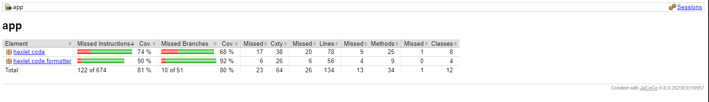

### Hexlet tests and linter status:
[](https://github.com/RomanVoronovskiy/java-project-71/actions)
[](https://codeclimate.com/github/RomanVoronovskiy/java-project-71/maintainability)
[](https://codeclimate.com/github/RomanVoronovskiy/java-project-71/test_coverage)

Цель
Вычислитель отличий – проект, который по-настоящему прокачивает даже опытных разработчиков. Здесь вам придется столкнуться с принятием сложных архитектурных решений, автоматизированным тестированием и непрерывной интеграцией, работой с структурами данных и алгоритмами их обработки.

## Структуры данных и Алгоритмы
Выбор правильных структур данных в коде – один из ключей к удачной архитектуре и простому коду. От этого зависит удобство анализа и обработки, количество и сложность условных конструкций.

Главный вопрос в проекте – как описать внутреннее представление дифа между файлами, так чтобы оно было максимально удобно. И хотя для этого существует множество разных способов, лишь некоторые из них приводят к простому коду.

Работа с структурами данных хорошо прокачивает алгоритмическое мышление. Это важно, так как реальная обработка сопряжена с постоянной обработкой данных, различными преобразованиями и выводом коллекций.

## Архитектура
Для построения дифа между двумя структурами нужно проделать множество операций: чтение файлов, парсинг входящих данных, построение дерева различий, формирование необходимого вывода. Все это требует хорошей организации кода. Модульность и абстракции выходят в этом проекте на новый уровень.

Помимо внутренней архитектуры, в этом проекте появляется необходимость работать с параметрами командной строки. Происходит углубление понимания работы операционных систем в целом и командных интерпретаторов в частности.

## Тестирование и Отладка
Автоматизированные тесты – неотъемлемая часть профессиональной разработки. Вычислитель отличий – идеальный проект для прокачки навыка тестирования. Он достаточно простой и удобный для написания тестов и достаточно сложный для того, чтобы прочувствовать важность этих тестов во время рефакторинга и отладки. В отличие от практики Хекслета, здесь предстоит писать тесты самостоятельно. Причем это можно делать до кода, практикуя TDD.

Для написания тестов используется фреймворк JUnit

## Описание
Вычислитель отличий – программа, определяющая разницу между двумя структурами данных. Это популярная задача, для решения которой существует множество онлайн-сервисов, например: http://www.jsondiff.com/. Подобный механизм используется при выводе тестов или при автоматическом отслеживании изменении в конфигурационных файлах.

Возможности утилиты:

+ Поддержка разных входных форматов: yaml и json
+ Генерация отчета в виде plain text, stylish и json

Пример использования:
```
# формат plain
./app --format plain path/to/file.yml another/path/file.json

Property 'follow' was added with value: false
Property 'baz' was updated. From 'bas' to 'bars'
Property 'group2' was removed

# формат stylish
./app filepath1.json filepath2.json

{
+ follow: false
+ numbers: [1, 2, 3]
  setting1: Value 1
- setting2: 200
- setting3: true
+ setting3: {key=value}
+ setting4: blah blah
  }
```

### Пример работы с файлами file1.json и file2.json и форматом stylish


### Пример работы с файлами file1.json и file2.json и форматом plain


###### Пример работы с файлами file1.json и file2.json и форматом json


### покрытие: 

